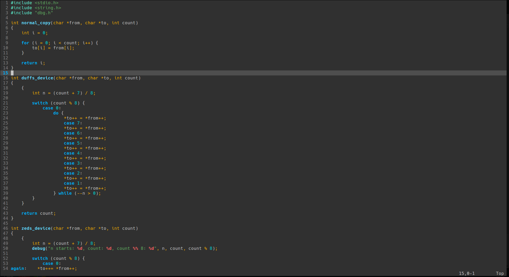

# Aperture Color Scheme for Vim
Aperture is a colorscheme for vim with emphasis on blue. <br />
It is recommended to use the [polyglot](https://github.com/sheerun/vim-polyglot) plugin for enhanced syntax highlighting. <br /> <br />


# Installation
1.) Place the aperture.vim file in your own machine's vim colors directory. (Usually ~/.vim/colors)

2.) Add the following to your .vimrc.
```
colorscheme aperture
```

3.) Make sure you have syntax processing enabled in your .vimrc with 
```
syntax enable
```

4.) Done!
